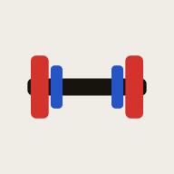

<p align="center">
  
</p>

<h1 align="center">B·I·L — Bar Is Loaded</h1>

<p align="center">
  <b>一人で、順位を賭けた重量の駆け引きを。</b><br>
  <b>Solo attempt-strategy calculator for powerlifting meets.</b>
</p>

<p align="center">
  
  
  
  
</p>

<p align="center">
  🌐 <a href="https://YOUR-USERNAME.github.io/bil/"><b>Live Demo</b></a>
  &nbsp;·&nbsp; <a href="#-日本語">日本語</a>
  &nbsp;·&nbsp; <a href="#-english">English</a>
</p>

<!-- スクリーンショットを追加すると効果的です / Add a screenshot here:
<p align="center"></p>
-->

---

## 🇯🇵 日本語

### 概要
B·I·L は、パワーリフティングの試合現場で **「あと何kg挙げれば、狙った順位に届くか」** を即座に出すための計算ツールです。自分とライバルの全試技（スクワット・ベンチ・デッド × 3試技）を記録すると、体重差を織り込んだ順位と、次の試技で必要な重量、そのプレートの積み方までを表示します。セコンドがいなくても、選手一人で駆け引きの判断ができることを目的にしています。

### 背景・課題
所属するパワーリフティング部は人数が少なく、試合で選手を補佐する「セコンド」が足りませんでした。さらにセコンドがいても、順位を賭けた終盤で「相手を抜くには次に何kg必要か」を、体重差や合法重量（2.5kg刻み）まで含めて即座に計算するのは難しい。この現場の課題を、自分一人で完結できる形にしたのが B·I·L です。

### 主な機能
- **全9試技の記録** — 自分とライバル（最大20人）を切り替え、SQ/BP/DL × 3試技を入力。成功/失敗はレフェリーライト式のランプで記録し、トータルを自動集計。
- **ライブ順位** — トータル順に自動ソート。同点は体重の軽い方が上位という公式ルールを反映。
- **駆け引き計算** — 「狙う順位」と「次に構える種目」を選ぶと、**〇位到達まであと〇kg**（トータル差）と、実際にバーへ積む重量・**片側のプレート内訳**を表示。
- **合法重量の担保** — 2.5kg刻みへ丸め、各試技は直前の試技以上のみ申請可（軽い値は無効化・自動補正）。
- **オフライン対応 PWA** — ホーム画面にインストール可能。電波の弱い会場でも起動・動作。入力は端末内に自動保存（サーバー送信なし）。

### 設計・技術的なポイント
- **体重差を含む必要重量の逆算** — 自分が相手より軽ければ同トータルで勝ち、同体重以上なら上回る必要がある、という条件を安全側で計算。
- **「トータル差」と「次の試技重量」の区別** — 既に確定した種目を除いて次の1本を解くため、上げ狙い（3本目の更新）でも正しい重量が出る。
- **実ルール準拠の入力検証** — 試技重量は単調非減少（前試技以上）。会場の申請ルールをそのまま反映。
- **依存ゼロ・単一構成** — フレームワーク不使用のバニラ JS。読み込みが速く、壊れにくく、どこにでも置ける。オフライン前提の会場ツールに最適。

### 技術スタック
バニラ HTML / CSS / JavaScript（依存パッケージなし） · PWA（Web App Manifest ＋ Service Worker によるオフラインキャッシュ） · localStorage による永続化 · デザインは競技のスコアシートに着想した独自のフラットな配色・タイポグラフィ。

### 構成
```
bil/
├── index.html        アプリ本体（UI・計算ロジック・状態管理）
├── manifest.json     PWA 設定（名称・アイコン・テーマ色）
├── sw.js             Service Worker（アプリシェルのオフラインキャッシュ）
└── icons/            アプリアイコン一式（192〜1024 / maskable / apple-touch）
```

### ローカルで動かす / デプロイ
静的ファイルのみのため、ビルドは不要です。
```bash
# ローカル確認（任意の静的サーバーで）
npx serve .
```
デプロイは GitHub Pages 等の静的ホスティングにこのフォルダを置くだけ。HTTPS 配信で Service Worker（オフライン）とインストールが有効になります。

### 今後
- 選手↔セコンドのリアルタイム同期（2台で同じ盤面を共有）
- 大会履歴の保存・結果の書き出し
- PWABuilder / Expo による各ストアへのネイティブ配布

### 作者 / ライセンス
Created by **YOUR NAME** — [GitHub](https://github.com/YOUR-USERNAME) · MIT License

---

## 🇬🇧 English

### Overview
B·I·L is a calculator for powerlifting meets that instantly answers **"how much more do I need to lift to reach the place I'm aiming for?"** Enter every attempt (squat, bench, deadlift × 3) for yourself and your rivals, and it shows the live standings with bodyweight tie-breaks, the exact weight required for your next attempt, and how to load the plates. It's built so a lifter can make tactical decisions alone, without a separate handler.

### The problem
My university powerlifting club is small, and we rarely had enough handlers ("seconds") to coach lifters at the platform. Even with a handler, working out — in the closing rounds, under time pressure — exactly how much you need to out-place a rival, accounting for bodyweight and legal (2.5 kg) increments, is genuinely hard. B·I·L turns that on-the-platform problem into something one lifter can do on their own phone.

### Features
- **All nine attempts** — Switch between yourself and up to 20 rivals; enter SQ/BP/DL × 3 attempts. Mark good/no-lift with referee-light style lamps; totals are computed automatically.
- **Live standings** — Auto-sorted by total, with the official tie-break: the lighter lifter ranks higher.
- **Tactics engine** — Pick your target place and the lift you're about to take, and it shows **how many kg you still need to reach that place**, the actual bar weight for your next attempt, and the **per-side plate breakdown**.
- **Legal weights enforced** — Rounds to 2.5 kg increments; each attempt must be ≥ the previous one (lighter entries are flagged and auto-corrected).
- **Offline PWA** — Installable to the home screen; launches and runs even on weak venue Wi-Fi. All input is saved on-device (nothing sent to a server).

### Engineering & design highlights
- **Bodyweight-aware required weight** — If you're lighter than your rival, an equal total wins; if you're equal or heavier, you must exceed. The required weight is computed on the safe side of that rule.
- **"Gap to place" vs "next-attempt weight"** — The next lift is solved with your already-secured lifts excluded, so the number is correct even when you're upgrading a third attempt.
- **Rule-accurate input validation** — Attempt weights are monotonically non-decreasing, mirroring how declarations actually work at a meet.
- **Zero dependencies, single build** — Framework-free vanilla JS: fast to load, hard to break, trivial to host anywhere — ideal for an offline-first venue tool.

### Tech stack
Vanilla HTML / CSS / JavaScript (no dependencies) · PWA (Web App Manifest + Service Worker offline caching) · `localStorage` persistence · a custom flat "scoresheet" design system for color and typography.

### Structure
```
bil/
├── index.html        The app (UI, calculation logic, state management)
├── manifest.json     PWA config (name, icons, theme color)
├── sw.js             Service Worker (offline app-shell cache)
└── icons/            Full icon set (192–1024 / maskable / apple-touch)
```

### Run locally / Deploy
No build step — it's just static files.
```bash
# Preview locally with any static server
npx serve .
```
To deploy, drop this folder onto any static host such as GitHub Pages. Served over HTTPS, the Service Worker (offline) and install prompt become active.

### Roadmap
- Real-time lifter ↔ handler sync (share one board across two phones)
- Meet history and result export
- Native store distribution via PWABuilder / Expo

### Author / License
Created by **Masaki Takakuwa** — [GitHub](https://github.com/takakuwa-mamada) · MIT License
